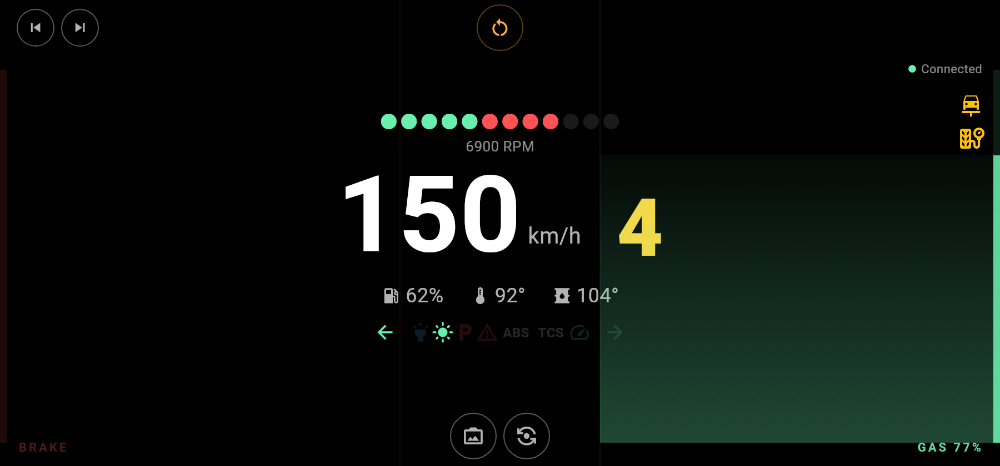
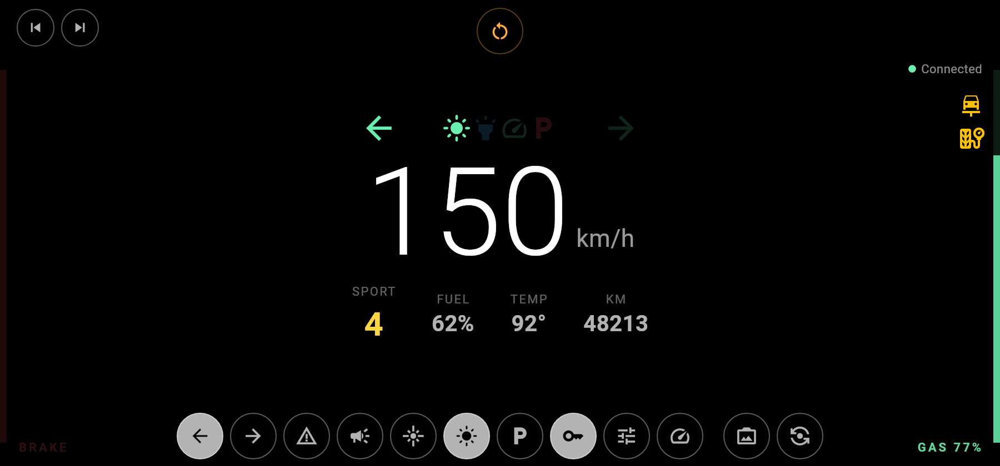
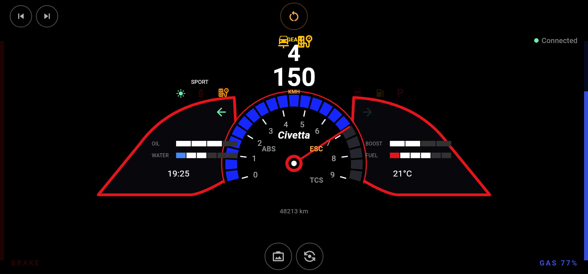
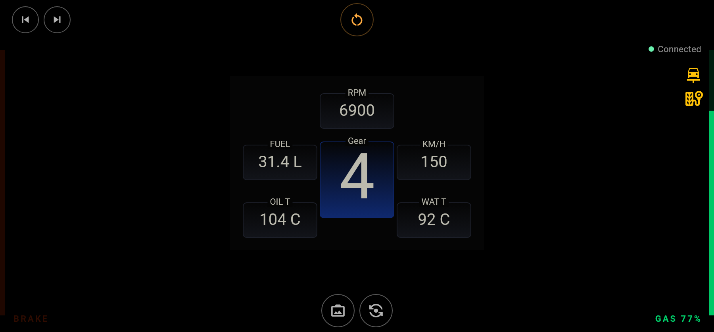
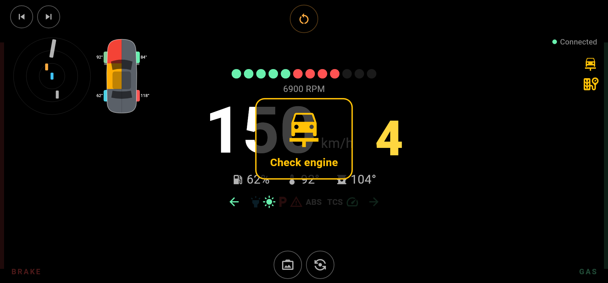
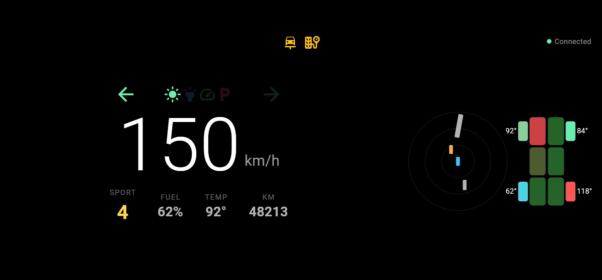

# BeamNG RemotePlus — Android app

**Drive [BeamNG.drive](https://www.beamng.com/) with your phone**: tilt to
steer, slide your thumbs to brake and accelerate, and watch a live dashboard
of your car.

## A new generation of BeamNG's remote control

BeamNG published an official phone controller,
[BeamNG/remotecontrol](https://github.com/BeamNG/remotecontrol), in 2014. It
is no longer maintained: the apps left the stores, the dashboard stopped
receiving data, the pedals were on/off only and the in-game QR code became
unreliable in 0.39.

**Beam-RemotePlus** takes over that project as a new generation, built from
scratch: it still speaks the game's native remote-control protocol (so it
works without anything else), and with the companion mod
**[Beam-RemotePlus-Mod](https://github.com/LucienLassalle/Beam-RemotePlus-Mod)**
it unlocks analog pedals, a full dashboard, vehicle functions, local
multiplayer and much more. It is a community project, not affiliated with
BeamNG GmbH.

## Gallery

| Default | Road |
|---|---|
|  |  |
| **Civetta** (Scintilla instrument screen) | **F4** (Carbonworks F4 wheel screen) |
|  |  |
| **Radar & damage panel** | **Second screen** |
|  |  |

Screenshots are rendered by the test suite (`scripts/flutter.sh screenshots`)
with sample data.

## Features

- **Steering**: tilt the phone like a wheel (360°–900° range, stabilisation,
  recalibration) or a touch bar; optional gear shifting by tilting forward /
  backward.
- **Analog pedals**: left 40% of the screen brakes, right 40% accelerates;
  slide up to press harder (the travel uses 80% of the height). Both thumbs
  at once.
- **Themes**: Default (clean), Road (everyday driving with all vehicle
  buttons), Civetta and F4 (replicas of in-game screens). Making a theme is
  easy: [THEMES.md](THEMES.md).
- **Vehicle buttons** (Road theme, each can be hidden): indicators, hazards,
  horn, headlight flash, lights, parking brake, ignition, drive mode, cruise
  control. Camera, vehicle switching and hold-to-reset on every theme.
- **Volume buttons**: volume up = horn, volume down = headlight flash (each
  one can be disabled).
- **Warning lights**: check engine, oil pressure, overheating, engine
  stopped, low fuel, fuel leak, flat tyre, low tyre pressure (compared to
  the pressure the car is set to), hot brakes, clutch overheating or
  damaged, broken drivetrain, turbo overheating, over-rev, water in the
  engine, gearbox damage (grinding gears, worn synchros), low air pressure
  (trucks, buses), parking brake while moving.
- **Vibrations** with an adjustable strength, each one can be switched off:
  wheelspin, locked wheels, impacts, kerbs, ABS, rev limiter.
- **Radar and damage panel**: nearby cars, and a damage schematic in the
  spirit of the game (body, radiator, engine, driveshafts and axles,
  brakes, jerrycan with the fuel level), tyre pressures and flat tyres,
  and tyre temperatures when the
  [Tyre Thermals and Wear](https://www.beamng.com/resources/) mod is
  installed in the game.
- **Settings saved on the phone**, in tabs: Display, Gameplay, Controls,
  Advanced.
- **Electric cars**: battery charge instead of fuel, motor power (kW,
  green while regenerating), electric motor and battery pack on the damage
  schematic, low battery and damaged battery warnings.
- **Second screen**: a phone or tablet showing only the dashboard, radar and
  damage while you drive with a real wheel or a gamepad.
- **Local multiplayer**: one phone per player, each phone shows up under its
  own name in the game.
- **Automatic connection** on the local network (no QR code), manual code or
  QR scan; reconnects by itself if the mod restarts.
- **English and French**, following the phone language (translations are
  plain files, see [TRANSLATING.md](TRANSLATING.md)).
- **Debug mode**: shows on screen the values the vehicle does not send and the
  commands the game refused.

Without the mod only steering and on/off pedals are available (that is all the
game's native channel offers).

## Installation

1. Download the APK from the
   [latest release](https://github.com/LucienLassalle/Beam-RemotePlus-Mobile/releases/latest):
   `arm64-v8a` for almost every recent phone, `universal` if unsure.
2. Install the [mod](https://github.com/LucienLassalle/Beam-RemotePlus-Mod)
   in BeamNG.drive and enable it in the mod manager.
3. Put the phone on the same Wi-Fi as the PC (or share the phone's hotspot
   with the PC), load a level and tap **Automatic connection**.

## Contributing

New themes, translations and fixes are welcome through pull requests, in
English or French: [CONTRIBUTING.md](CONTRIBUTING.md). Only Podman is needed
to build and test.

```bash
scripts/flutter.sh test          # unit and widget tests
scripts/flutter.sh screenshots   # renders every theme to PNG
scripts/build_apk.sh 2.1.0       # release APKs in dist/
```

## License

[CC BY-NC-SA 4.0](LICENSE): share and adapt for non-commercial purposes, with
attribution, under the same license. BeamNG.drive is a trademark of BeamNG
GmbH.
